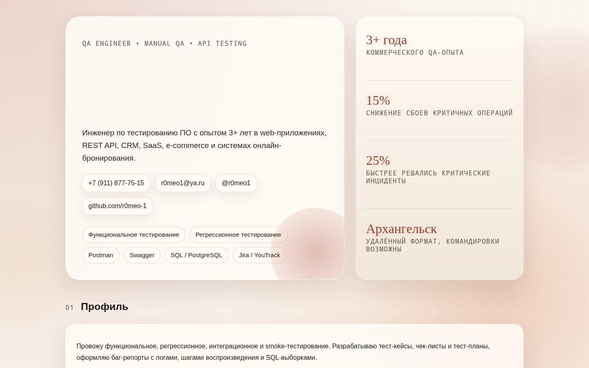
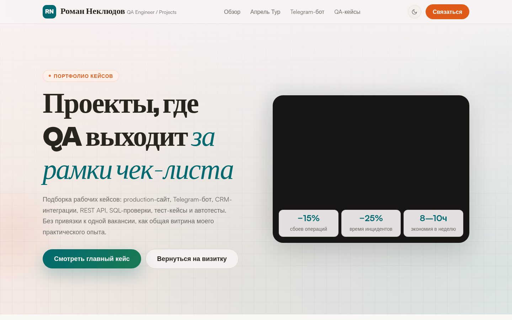

# r0meo1.ru — QA Engineer Portfolio

> Personal portfolio site of Roman Neklyudov, a QA Engineer with 3+ years of commercial experience in web apps, REST API, CRM, SaaS, e-commerce and online-booking systems.

Live site: **[r0meo1.ru](https://r0meo1.ru/)**



## About

A lightweight, hand-built static résumé/portfolio website (content in Russian). It presents Roman's QA profile, experience, tooling and selected case studies.

**Pages**

- **`index.html`** — landing page: hero with contacts and headline metrics, professional profile, key experience timeline, tools & stack, measurable results, project cards, education and languages.
- **`projects.html`** — deeper write-ups of selected QA cases: a tour-agency website shipped to a custom domain with auto-deploy, a Telegram bot for lead intake, CRM/REST API integration testing, SQL data-quality work and a full-stack training project.
- **`enjoycamp.html`** — a standalone landing/case page.
- **`apreltour/`** — a separately built (React/Vite) sub-site for the "Aprel Tour" agency, published under `/apreltour/`.



## Tech

- Static **HTML5 + CSS3** (no build step for the main site) — see `styles.css`.
- A small vanilla-JS `IntersectionObserver` for scroll-reveal animations.
- Deployed on **[Netlify](https://www.netlify.com/)** with redirects/routing configured in `netlify.toml` (publish directory: repo root).

## Local preview

No build tooling or dependencies are required for the main site — it's plain static files. Clone and serve the directory:

```bash
git clone https://github.com/r0meo-1/r0meo1.ru.git
cd r0meo1.ru

# Option 1: open directly
open index.html        # macOS  (use xdg-open on Linux)

# Option 2: serve over HTTP (recommended, mirrors Netlify routing)
python3 -m http.server 8000
# then visit http://localhost:8000
```

## Structure

```
.
├── index.html          # main portfolio landing page
├── projects.html       # detailed QA case studies
├── enjoycamp.html      # standalone landing/case page
├── styles.css          # site styles
├── netlify.toml        # Netlify build & redirects config
├── apreltour/          # built sub-site (Aprel Tour)
└── docs/screenshots/   # README screenshots
```

## Contact

- Telegram: [@r0meo1](https://t.me/r0meo1)
- Email: r0meo1@ya.ru
- GitHub: [r0meo-1](https://github.com/r0meo-1)

## License

Released under the [MIT License](LICENSE).
